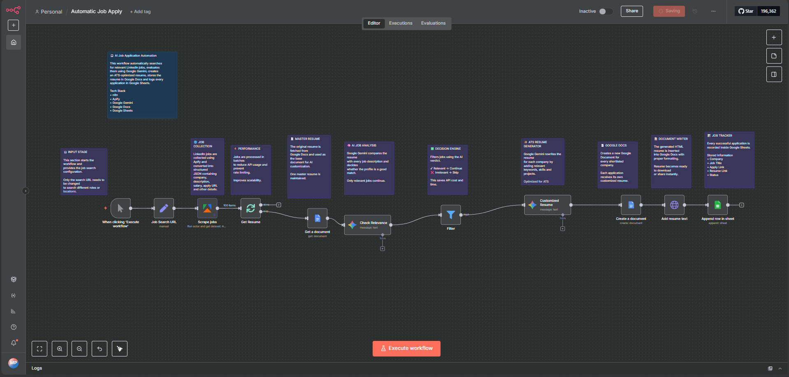
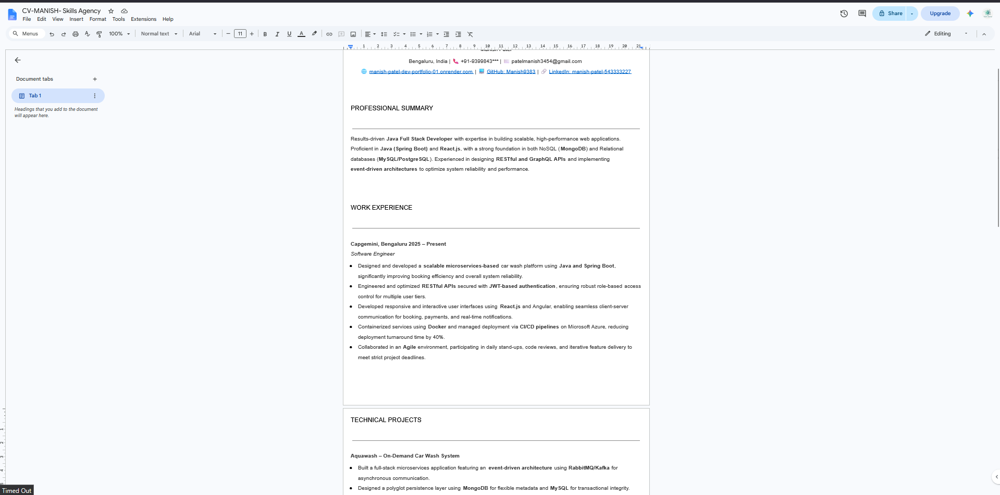
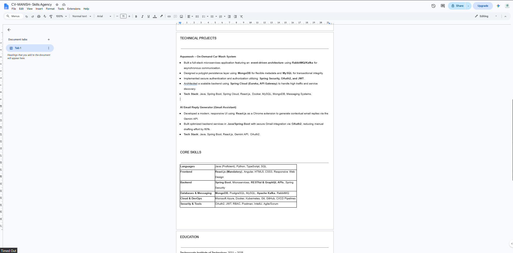
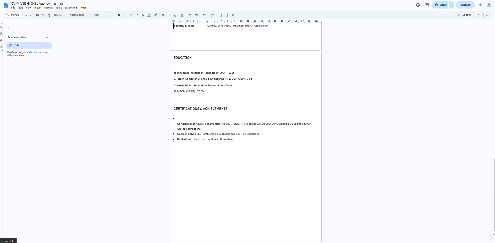
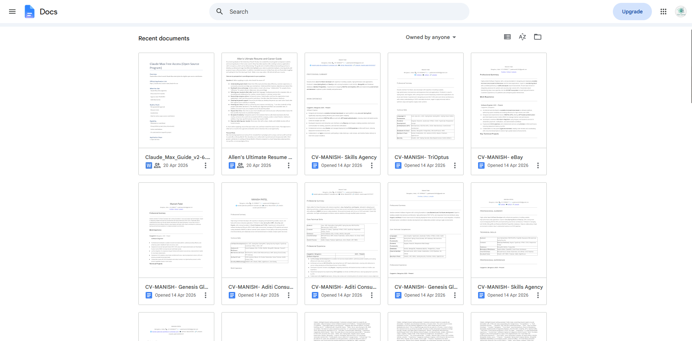
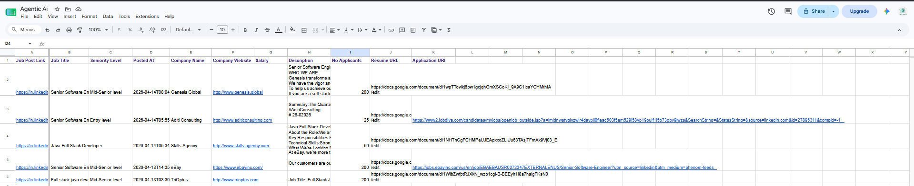

# 🤖 AI Job Application Automation


An AI-powered automation workflow built using **n8n** that automatically searches LinkedIn jobs, evaluates job relevance using **Google Gemini**, generates **ATS-optimized resumes**, stores them in **Google Docs**, and logs every application into **Google Sheets**.

---

# 🚀 Features

- 🔍 Automatically searches LinkedIn jobs
- 🤖 AI-powered job relevance analysis using Google Gemini
- 📄 Reads a master resume from Google Docs
- ✨ Generates ATS-optimized resumes for each job
- 📑 Creates a separate Google Doc for every customized resume
- 📊 Tracks every processed job in Google Sheets
- ⚡ Batch processing to reduce API usage
- 🧠 Fully automated workflow built with n8n

---

# 🏗 Workflow Overview




---

# ⚙️ How It Works

```text
Manual Trigger
      │
      ▼
LinkedIn Search URL
      │
      ▼
Apify Job Scraper
      │
      ▼
Batch Processing
      │
      ▼
Read Master Resume
      │
      ▼
Google Gemini
(Job Relevance Check)
      │
      ▼
Relevant?
      │
      ├── No → Skip Job
      │
      └── Yes
             │
             ▼
Generate ATS Resume
             │
             ▼
Create Google Document
             │
             ▼
Write Resume
             │
             ▼
Update Google Sheet
```

---

# 🛠 Tech Stack

| Category | Technology |
|-----------|------------|
| Workflow Automation | n8n |
| AI Model | Google Gemini |
| Job Scraping | Apify |
| Documents | Google Docs API |
| Database | Google Sheets |
| Programming | JavaScript |
| Resume Generation | Gemini AI |

---

# 📂 Project Structure

```
AI-Job-Application-Automation/
│
├── README.md
├── LICENSE
│
├── workflow/
│   └── AI_Job_Application_Automation.json
│
├── screenshots/
│   ├── workflow-overview.png
│   ├── generated-resume.png
│   ├── google-doc.png
│   └── google-sheet.png
│
├── docs/
│
└── sample-output/
```

---

# 📸 Screenshots

## Workflow


---

## Generated Resume





---

## Google Docs Output



---

## Google Sheets Tracker



---

# 🚀 Getting Started

## Prerequisites

- n8n
- Google Account
- Google Docs API
- Google Sheets API
- Google Gemini API Key
- Apify Account

---

## Setup

### 1. Clone the repository

```bash
git clone https://github.com/Manish9383/AI-Job-Application-Automation.git
```

### 2. Import the workflow into n8n

Import

```
workflow/AI_Job_Application_Automation.json
```

### 3. Configure Credentials

Configure the following credentials inside n8n:

- Google Docs
- Google Sheets
- Google Gemini
- Apify

### 4. Update LinkedIn Search URL

Modify the search URL according to:

- Job Title
- Experience
- Location

### 5. Execute Workflow

Run the workflow manually or schedule it using a Cron Trigger.

---

# 📈 Future Improvements

- Automatic LinkedIn Easy Apply
- AI Cover Letter Generation
- Email Notifications
- Telegram Alerts
- Resume Versioning
- Job Recommendation Dashboard
- Multi-Resume Support

---

# 📄 License

This project is licensed under the MIT License.

---

# 👨‍💻 Author

**Manish Patel**

Software Engineer | Java Full Stack Developer | AI Automation Enthusiast

- GitHub: https://github.com/Manish9383
- LinkedIn: *https://www.linkedin.com/in/manish-patel-543333227/*

---

## ⭐ If you found this project useful, please consider giving it a Star!
